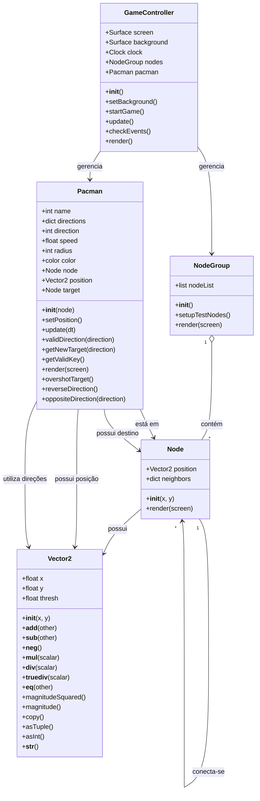

# Diagrama de Classes

O diagrama abaixo representa as principais classes do projeto e seus relacionamentos.



## Descrição dos relacionamentos

### `Vector2`

A classe `Vector2` representa um vetor bidimensional e é utilizada para representar posições e direções no jogo.

Ela é utilizada principalmente pelas classes `Node` e `Pacman`.

---

### `Node`

Um `Node` representa um ponto do mapa.

Cada nó possui:

* Uma posição (`Vector2`);
* Um conjunto de possíveis vizinhos;
* Conexões com outros `Node`.

Os vizinhos são armazenados em um dicionário utilizando as direções `UP`, `DOWN`, `LEFT` e `RIGHT`.

```text
Node
 ├── position → Vector2
 └── neighbors
       ├── UP → Node
       ├── DOWN → Node
       ├── LEFT → Node
       └── RIGHT → Node
```

---

### `NodeGroup`

`NodeGroup` é responsável por organizar os diversos nós existentes no mapa.

Ele mantém uma lista:

```python
nodeList
```

que contém os objetos `Node`.

O relacionamento pode ser representado como:

```text
NodeGroup
    │
    ├── Node
    ├── Node
    ├── Node
    └── ...
```

---

### `Pacman`

A classe `Pacman` representa o personagem controlado pelo jogador.

Ela possui uma relação com `Node`, pois o personagem utiliza os nós para determinar sua posição atual e seu próximo destino.

Também utiliza `Vector2` para representar:

* Sua posição;
* Suas direções de movimento.

---

### `GameController`

`GameController` é responsável por coordenar o funcionamento do jogo.

Ele mantém referências para:

```text
GameController
    │
    ├── NodeGroup
    │      └── Nodes
    │
    └── Pacman
```

Além disso, controla:

* A janela do jogo;
* O background;
* O relógio do jogo;
* A atualização dos objetos;
* Os eventos do Pygame;
* A renderização.

## Visão simplificada

A estrutura principal do projeto pode ser entendida da seguinte maneira:

```text
                  ┌─────────────┐
                  │ Vector2     │
                  │             │
                  │ x, y        │
                  └──────┬──────┘
                         │
                         │ utiliza
              ┌──────────┴──────────┐
              │                     │
              ▼                     ▼
       ┌─────────────┐       ┌─────────────┐
       │    Node     │       │   Pacman    │
       │             │       │             │
       │ position    │       │ position    │
       │ neighbors   │       │ node        │
       └──────┬──────┘       │ target      │
              │              └──────┬──────┘
              │                     │
              │ contém              │
              ▼                     │
       ┌─────────────┐              │
       │  NodeGroup  │              │
       │             │              │
       │ nodeList    │              │
       └──────┬──────┘              │
              │                     │
              └──────────┬──────────┘
                         │
                         │ gerencia
                         ▼
                  ┌──────────────┐
                  │GameController│
                  │              │
                  │ screen       │
                  │ background   │
                  │ clock        │
                  └──────────────┘
```

## Observação

Os arquivos `constants.py` e `run.py` também fazem parte da arquitetura do projeto, porém `constants.py` contém principalmente constantes utilizadas pelas classes, enquanto `run.py` é responsável por iniciar a aplicação. Por isso, o diagrama concentra-se nas classes que representam os principais objetos e comportamentos do sistema.
